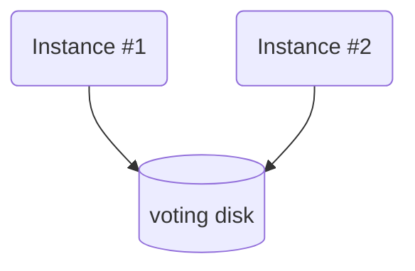
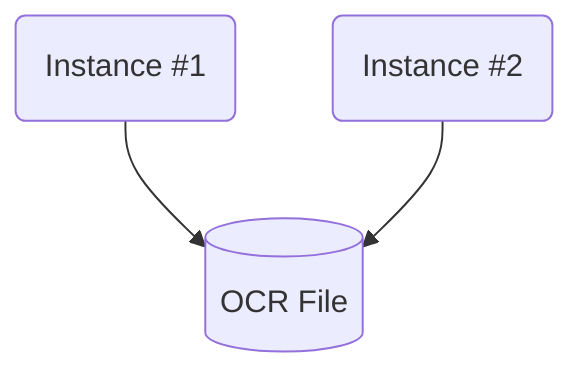

## ⭐⭐ RAC 핵심10. Voting Disk와 OCR File의 역할 ⭐⭐

Oracle RAC 환경에서는 두 가지 중요한 파일, Voting Disk와 OCR(Oracle Cluster Registry) File이 핵심적인 역할을 합니다.

### 1️⃣ Voting Disk ?

Voting Disk는 클러스터의 **'두뇌'** 역할을 하는 파일입니다. 

이 파일은 클러스터 노드들의 '심장박동' 정보를 포함하고 있으며, 

모든 노드들이 서로 연결되어 있고 정상적으로 작동하고 있는지를 확인하는데 사용됩니다. 

**⚡ Split brain 현상**, 즉 동일한 클러스터 내에서 노드들이 서로 다른 클러스터로 분할되어 
독립적으로 작동하는 것을 방지하는 정보도 저장하고 있습니다. 

Split brain은 데이터의 무결성을 손상시킬 수 있는 위험한 상태이므로, Voting Disk를 통해 이를 예방하고  
 클러스터의 일관성을 유지합니다.

### 2️⃣ OCR File ?

**OCR(Oracle Cluster Registry) File**은 클러스터 구성 및 상태에 관한 메타데이터를 저장하는 파일입니다. 

이 파일에는 RAC 환경 내에서 실행되는 응용 프로그램들의 구성 정보가 포함되어 있으며, 

예를 들어 데이터베이스 인스턴스, 리스너, 가상 IP(VIP), Automatic Storage Management(ASM), 서비스 등의  
 정보가 저장됩니다. 

OCR 파일은 클러스터의 구성 변경사항을 추적하며, 이 정보를 통해 클러스터 서비스가 올바르게   
작동하도록 합니다.
&nbsp;
&nbsp;
&nbsp;

😊 Voting Disk와 OCR File은 클러스터의 안정성과 관리에 중요하기 때문에 안전하게 보관되어야 하며,   
    &nbsp;  &nbsp;  &nbsp; 일반적으로 이중화 또는 다중화하여 장애에 대비합니다.

